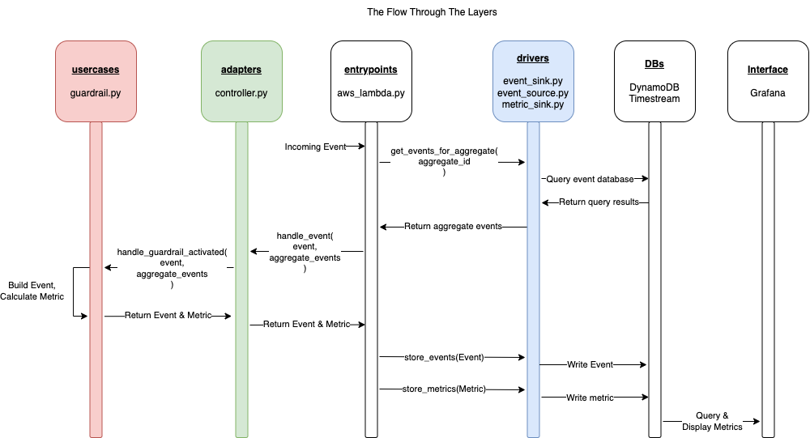

# Flight Controller on AWS Cloud Platform

This repository contains the code necessary for Flight Controller on GCP.

## What is Flight Controller?

Flight Controller is a unified, event-driven, data measurement service for capturing interesting events in a GCP environment.

The intent is to make it trivial to add new measures, allowing teams to be data driven and enable [SLO driven product development](https://www.youtube.com/watch?v=R_Uz5nkigdQ&list=PLIuxSyKxlQrAsbULewWndxvKIVW9y8LIK&index=20).

The approach to scaling a landing zone on AWS is [elaborated here](https://aws.amazon.com/blogs/mt/flight-controller-by-contino-a-solution-built-on-aws-control-tower/).

## Architecture

## Development

### Prerequisites

- Python version 3.10
- Pipenv (version 2022.10.12 proven working)
- Terraform version 1.2.7
- Docker installed

- AWS CDK
    - NVM -> npm and node https://github.com/nvm-sh/nvm#usage 
    - AWS CLI https://docs.aws.amazon.com/cli/latest/userguide/getting-started-prereqs.html
    - AWS CDK https://docs.aws.amazon.com/cdk/v2/guide/getting_started.html

Optional

For macOs get graphviz for the diagrams to work
    - brew install graphviz 

### start of day

- Get tokens from https://continohq.awsapps.com/start#/
- set up aws cdk
    - $ cd infra_aws_cdk; source .venv/bin/activate 

### Local Environment Set Up

`make local`

### Testing

Testing is split into four commands:

- `make unittest` runs all the unit tests (i.e. tests that are not [marked as integration](https://docs.pytest.org/en/7.1.x/example/markers.html))
- `make integration-test` run all the integration tests 
- `make test` runs all the tests and reports on coverage 
- `make e2e` runs the end to end BDD tests using [behave](https://github.com/behave/behave) 
- `make build-aws-cdk` builds the infra with AWS CDK
- `make deploy-aws-cdk` deploys the infra with AWS CDK

### testing from console

After you deploy your infrastructure you can interact with the eventbridge on AWS by sending different messages by runnig the following from the 'infra_aws_cdk' folder:

- Send Project requested event
    - aws events put-events --entries file://./infra_aws_cdk/test/events/test-eventR.json 
- Send Project assigned event
    - aws events put-events --entries file://./infra_aws_cdk/test/events/test-eventA.json 
- Send Project created event 
    - aws events put-events --entries file://./infra_aws_cdk/test/events/test-eventC.json 

### Code Structure

The code is structured in the [Clean Architecture](https://blog.cleancoder.com/uncle-bob/2012/08/13/the-clean-architecture.html) pattern.

The current layers are:

1. `Entities`, which contains domain objects
2. `Usecases`, which orchestrate domain objects
3. `Adapters`, which convert events and data into known types
4. `Drivers`, which interact with data storage
5. `Entrypoints`, which handle the event from GCP, retrieve and store data through drivers and call adapters to perform the needed business logic

The core rule of Clean Architecture, is that a layer can only depend on the layers that have come before it. E.g. code in the `usecases` layer, may depend on `entities`, but cannot depend on `adapters` or `drivers`.

When developing, it is simplest to start at the first layer and work down ending up with the entrypoint. This forces you to focus on the domain objects first before considering external services.

### Deploying a change

- synthsis and deploy infra
    - cdk synthesize
    - cdk deploy

### Merging changes

At the current time there are no branch protections. However, as the build process creates a commit for every build, to keep the git history clean, please `rebase/squash` your commits before pushing. You can do this by running `git fetch origin main && git rebase -i origin/main`, `edit`ing the first commit, and applying `fixup` to all following commits.

# how to create a new metric?

1- First of all, you need to define a SLO. In this example we will work with 2 SLO's. These SLO's are related to creation of a "project" at a client. 
    
    - "time taken between requesting a project and assigning the request to be executed"
    - "time taken between requesting a project and finally creating the project"

2- Next you need to understand the "process" for "creating a project". This includes actors, systems, and automation that contributes to creation of a "project" from start to end. From the process diagram we need to identify the events that are associated each component of the "process". "Event" in the process shold have minimum the following fields
    
    - correlation_id: this is id to all events that is part of an instantioantion of a process. For example, when one requests, assigns, and creates a project all the events will have the same correlation id.
    - event_type: this is the type of event, this can be any string representing what happened.
    - time: time when the event happened
    - (Optional) payload: Any other detail one needs to add to the event for additional needs.

3- Map the event to entities by creating a python file for entities under code/src/entities. See for example the projects.py for entities. Entities come in two form:
    
    - Event Entites: corresponding to the events of the domain
    - Metric Entities: corresponding to the SLO's you have defined in step 1

4- Calculation of metrics are handled in the usescases. Insert a new use case under code/src/usecases that calculates the metric you are after. You can see the example how the project creation metrics are calculated in the projects.py.

5- Controller is where you covert external message to "entity". It delegates the metric handling to "usecases" above. you can find the controller at code/src/adapters folder

6- Once you have finised the entites, usecases, and adaptors it is time to build the external layers. First one is the driver layer where events are stored. Drivers are implemented based on the choice of cloud environment. you can see two examples one being the bigquery and the other is DynamoDB+TimesStream. these dirvers interact with the actual DB that stores the entities and metrics to be used. This layer also contains the UI where the metrics are shown.

7- One last code is needed to provide an entry point to the system. This is the part where platform message comes in and every part of the system is orchestrated. 

# Roadmap

- create dashboard integration
- Update integration and automation tests
- Create tfcdk build
- create Dockerized lambda code for product creation metric

# Questions
- account oyu have created is not working. gives https://portal.aws.amazon.com/billing/signup/incomplete.
- Also how to use https://granted.dev/ without copying the session keys from browser because this is not SSO :(
- Driver L1 in the diagram is dictated by the DB choice of the implementation. can we seperate them or is it OK. also how to use the "use case interactor" to allow driver to interact with DB on the same level?
- we are missing the dependency injection at this point. 
- what does entrypoint belong to?
- How can I use the timestream with the hosted grafana?
